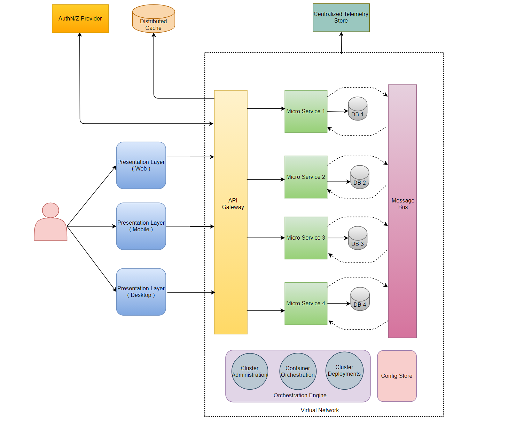
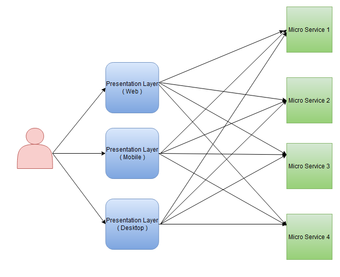
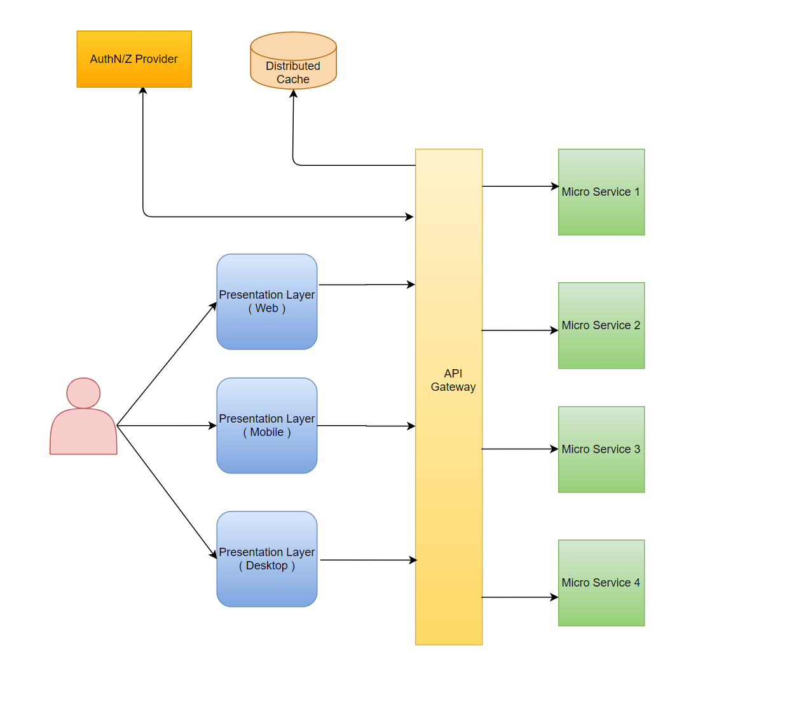
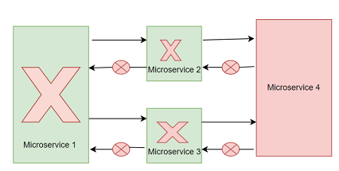
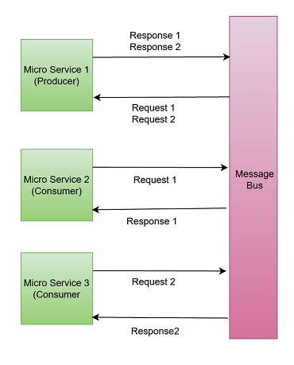
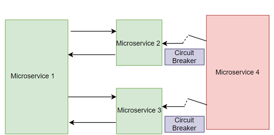

Complex large scale applications that are considering adopting Microservices architecture should follow a set of patterns to realize its full benefits. I will share those best practices and how they can improve the efficiency of your application as a two-part series.

I would highly recommend going through my earlier post , if your team is still deciding on whether microservices is the right architecture for your application.

- Let's look at a list of general concerns that every team adopting Microservices has to tackle :
  - Increased overhead for client applications as they have to be aware of multiple frequently updating microservices.
  - Impact on team's productivity as they have to address cross cutting concerns (like Auth, Caching, Logging etc.) consistently across each microservice.
  - Impact on application reliability as every client request has to go through multiple microservices for it to be processed.
  - Increased complexity with debugging and troubleshooting an issue as there is no tracing and observability of the request flow.
  - Impact on DevOps productivity as they have to deploy multiple microservices, monitor the health of every microservice and address downtime, traffic bursts and scale.
  - Increased DevOps efforts as config changes and secret rotations needs to be handled consistently across each microservice.

To keep this post concise, I will address the first 3 concerns here and the remaining 3 in a follow up post.

This is a high level application architecture that I have seen most teams adopt to tackle these issues, let's dig through each of the key areas below

## Abstracting internal cluster complexities

In most of the applications, it is very common for a single UX page to get its data from multiple Microservices. In order to establish communication with these services, the client needs to be aware of all the details like ports, protocols and how the resources are partitioned across. In addition to this, any update to these services might require a change in the client. Also there is a demand to power multiple versions of a given API. For instance, an API for web\desktop versions and a lighter API for the mobile version. As a result of all this churn, the application ends up in an architecture resembling this.

This brings us to the question, how can Microservice based clients access the individual services (API's) while catering to all these demands.

Clients should be abstracted out of these internal complexities and this is where an API Gateway plays an important role . API Gateway is the single point of entry for the all the client requests. It acts like a reverse proxy that serves all the client traffic to the microservices in the cluster.

- Here are the advantages of the modified architecture with API Gateway
  - Every client is not required to be aware of all the microservices and the endpoints it needs to talk to. This gives the application team flexibility to eventually migrate out of a microservice , make modifications to existing services or create a new microservice.
  - We can offload any cross cutting concerns like Authentication, Logging and Caching to this gateway layer. For instance, by allowing only Authenticated and Trusted client traffic to flow through the gateway to microservices. Also internal communication between the services can happen over a trusted private network without worrying about handling additional overhead like Authenticating the request and securing communications over SSL.
  - It can also help with API Composition by querying multiple microservices and joining on the results to produce the final aggregated response.
  - It can also act as a Rate Limiter by throttling requests coming from a client that has gone into a bad state, this helps in making the cluster more fault tolerant.

## Handling internal communication between Microservices

Microservices must handle requests from application clients while collaborating with each other to process them. Synchronous communication expects the client and the dependent services to be available for the entire duration of the request. It is generally better to avoid synchronous communication between services if possible, as it reduces the dependency between the request sender and request consumer to process at the same time. It also avoids some common pitfalls like cascading failures as you can see in the below scenario.

In this scenario, Microservice 1 is dependent on Microservice 2, Microservice 3 and Microservice 4 (through Microservice 2 and Microservice 3).

If Microservice 4 is down at the time of the client request, it results in a failure of the entire request. If not handled properly these communication failures to Microservice 4 will gradually overload Microservice 2 and Microservice 3 bringing them down and in turn Microservice 1 thus bringing the whole system down.

#### Message Bus

Whenever possible we should ensure that communication between microservices happen in an asynchronous way using a messaging service (which I call Message Bus in the architecture). There are numerous async messaging technologies available in the market like Azure service bus, Apache Kafka, RabbitMQ.

- While this is more complicated than a direct service to service communication, using a Message Bus for communication between Microservices has following advantages :
  - Enables decoupling of the request producer from the request consumer giving them the flexibility to process requests at their own scale.
  - Gives the flexibility for each microservice to scale up and down based on the bursts in traffic. Neither the producer nor the consumer need to worry about request throttling.
  - Improves the overall availability and fault tolerance of the system as the producer is less concerned with handling failures from the consumer. Consumers can be rest assured that as long as the proper message payload is published to the Message Bus it will be processed eventually.

In scenarios where async communication is not possible and the services have to rely on direct communication, it is generally a best practice to use a combination of circuit breaker pattern and retrying with exponential back off to counter cascading failures.

#### Circuit Breaker

This is similar to an electrical circuit breaker. As per this pattern, When the failure rate of service 4 exceeds a threshold in a given time window, services 2 and 3 will break the circuits (connection) and return a default predefined response instead of calling service 4. During this duration the faulty service is not invoked except for the small percentage of requests. If these calls succeed, then the connection will be resumed for the rest of the traffic, giving ample time for service 4 to recover.

#### CQRS ( Command Query Response Segregation )

Most of the teams that are working on an eventually consistent system, segregate reads from writes with a pattern called CQRS. In this pattern, the read ( or GET ) requests are fulfilled with direct service to service communication, while the write ( POST, PUT , PATCH or DELETE ) requests are fulfilled using the async communication. While responding to the read requests, the services mostly read from their cached or read only replicas of the data source. This helps in segregating the queries from commands and provides flexibility to scale, cache and evolve independently.
In my upcoming post, I will cover the patterns like Cluster Orchestration, Centralized Telemetry and Configuration Management which will help address the rest of the concerns discussed at the beginning
