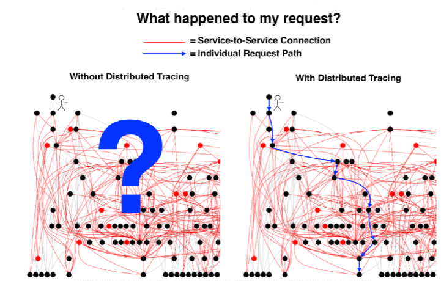
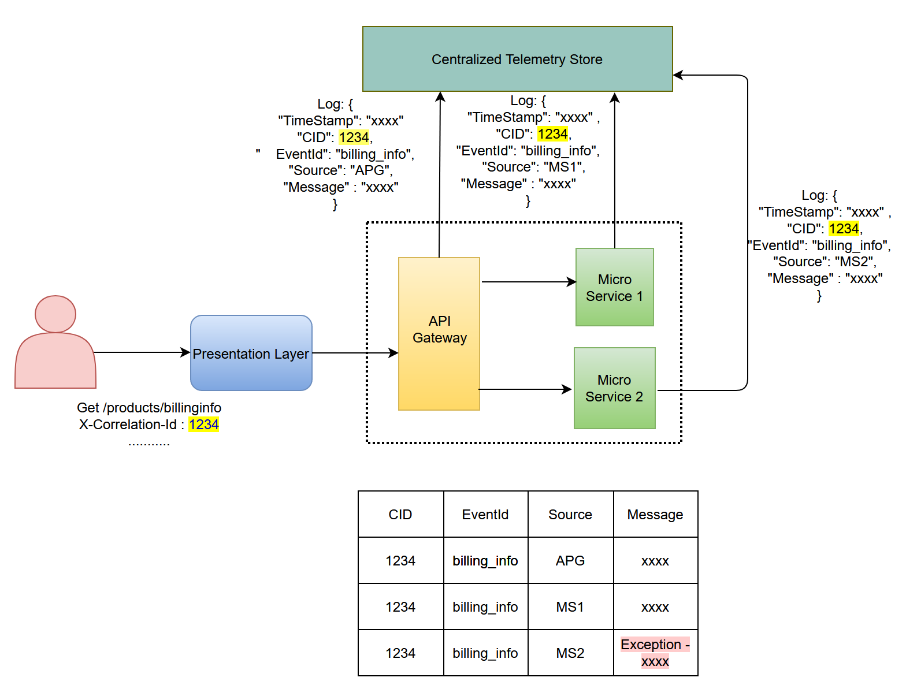
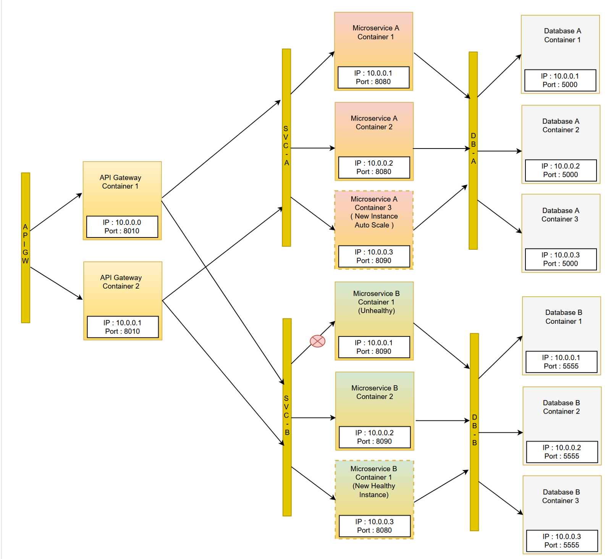
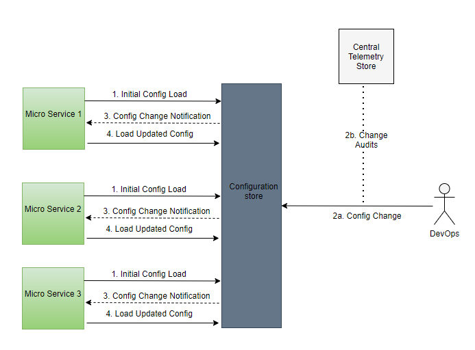

Any large scale Microservices application can realize the full benefits of the architecture and avoid common pitfalls by adopting certain successful proven design practices. We talked about how an API Gateway and a Message Broker can abstract out internal cluster complexities, provide a common location for implementing cross cutting concerns and improve application reliability in the [first post](https://contextswitch.dev/microservices-patterns-1) of this series.

- In this second and final post let's look at :
  - How a Centralized Telemetry store can ease out tracing and debugging by providing observability into the request flow.
  - How a central Configuration store and an Orchestration engine can drastically reduce the operations cost and provide easy to use APIs for automation.

## Centralized Telemetry Store :

A single client request workflow, might end up spanning multiple secondary requests which need to hop across microservices for them to be processed, making it very complicated to trace through the request flow and identify any failures or performance bottlenecks.

Implementing Distributed tracing using a centralized telemetry store helps with easing this problem. One general theme that I have seen teams follow is to define a common telemetry log schema that each service has to follow for publishing logs to the central store.

In the above scenario, the attribute marked CID (correlation id) is what tracks the request across the entire workflow and gets logged to the Telemetry store at each service layer. Even errors are logged with the CID. Logs in the store are queried with the CID to trace the request flow along with the point of failures.

- A Centralized Telemetry Store can help with :
  - Enabling a distributed trace of a given request flow using a correlation token.
  - Querying and aggregating metrics like failure rate (failures in last 'N' secs), request rate (RPS), can be used to setup workflows that can auto heal, scale and shutdown a service based on pre-defined conditions.
  - Performance logging for each service to a centralized location can help with investigating bottlenecks and its frequency of occurrence.
  - Auditing all the inbound and outbound requests for a microservice can help analyze user behavior which can further be used to evaluate the success rate of any feature that is experimented.
  - Auditing also helps us with anomaly detection and identifying security and compliance issues within the application.

## Orchestrating Cluster Management

Every microservice has to take dependency on other components in the cluster, at a minimum it has to interact with a datastore/service and an API Gateway. Each such microservice will have multiple replicas running on different IP addresses and ports. These replicas in turn have to interact with other replicas of datastore and API Gateway. Now imagine managing and orchestrating a cluster that hosts an application with > 5 microservices, each with their own set of replicas that interact with replicas of their dependencies. This is where a production grade cluster orchestrators like Kubernetes will help reduce this complexity by a great deal.

Let's take a look at the zoomed-in version of the cluster with 2 microservices

- Cluster orchestrator has following advantages :
  - The Orchestrator can manage the cluster to reflect the configured desired state. If a given microservice (Microservice B) is configured to have 2 replicas, the orchestrator maintains the configured state by spinning another instance in case one service replica is down.
  - Based on the bursts in traffic or resource utilization, the orchestrator can automatically scale up/down the number of replicas configured for a microservice (as you can observe in Microservice A).
  - Abstracts out all the complexities (like IP address, port and # of replicas running) of the dependencies by wrapping them with a Load balancer service (as you can observe with each "orange" colored service layer) and orchestrates proper communication flow between these services.
  - Releasing a new version or Rolling back to an old version of any given microservice or a set of microservices in the cluster is made easy by providing deployment automation APIs.
  - Gives flexibility to control traffic flow to the replicas of the services and performs A/B testing of various versions.

## Centralized Configuration Store

Every application built on Microservices needs to be tested right from development through pre-production. Though Microservices are supposed to be decentralized, certain components still need to be centralized to ease deployment pain. Before deploying to production, a typical microservice is deployed in Dev, Test, Pre-Prod environments. Each service has its own separate application configuration, deployment configuration file etc. for every environment. So imagine each service has 3–4 different environments and we have 10's of such microservices in our application, we will end up with plethora of files and managing them is definitely a nightmare. This problem is solved by consuming a centralized store where all the configuration files are placed so that the application can run smoothly.

There are several solutions that are built as distributed key-value store like Zookeeper, Azure App Configuration available in the market. Kubernetes also has a Secret and Config management feature to solve this need.

- Above picture displays a general best practice followed for config/secret management.
  - Every microservice loads the base configuration into memory during initial bootstrap of the service.
  - All subsequent changes are done by the DevOp members and are audited in the telemetry store before updating the config store.
  - Any update to the dependent configuration is notified by the config store to the appropriate microservice.
  - Microservice updates it's in-memory version of configuration with the latest changes.

* Having a centralized configuration store has the following advantages :
  - The configuration store is generally a centralized, highly available and geo redundant store, where the services can safely rely on to fetch most recent config data.
  - Auditing and notification of changes give flexibility to troubleshoot any deployment or code failures due to config changes.
  - Easy switching of the cluster environment without worrying about modifying configuration values across each service.

In this two part series of posts, we talked about the best design practices that successful products have adopted in a microservices architecture and how they can help alleviate some of the most common concerns.
