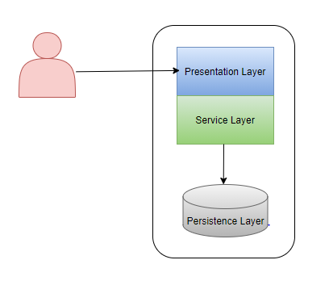

Microservices as an architectural pattern, is something almost every team building applications on cloud would have considered adopting at some point of the application lifecycle. Over the past few years I have been part of these discussions with various teams that either took the journey to transform their existing systems into microservices or continued with their existing architectures.

One thing that is very evident from my experience is the fact that, Microservices are not a good fit for every team that builds software on cloud. Some teams are more productive building a monolith or a variation of tiered architecture. With the techniques learnt and experience garnered working with various teams I will try to answer the obvious question — **When should I adopt Microservices as my application architecture ?**

## The Monolith ##

In early days most of these teams were small and were building applications as a single autonomous unit where the presentation layer is tightly coupled with the service and persistence layers. This is what we call a monolithic architecture, where any minor change to any part of this application requires deployment of the whole application.

* Generally it is still a good practice for teams to adopt this architecture, If one or more are true:  
    - The team does not have a huge code churn and does not require frequent releases  
    - The team is in a prototyping stage  
    - The team has a single form factor (i.e. either a Desktop , Web or Mobile application)

* These teams derive the following advantages :
    - Improved productivity due to simpler development and deployment.
    - Ease of debugging and tracing, most of the errors caused by changes can be caught during compile time as entire app is a single autonomous block
    - If coded properly, monolithic applications can be performant and reliable.
    - Lesser cross cutting concerns like Security, Authentication, Caching and Logging.

## An Evolution to a 3- tier architecture ##

Eventually these applications started gaining more traction. Increase in user adoption resulted in an increased demand for supporting multiple form factors (especially mobile). 
* As a result, the teams started hitting following constraints with monolithic architecture:
    - In a mobile first world, supporting Mobile based form factor in addition to web became all the more important. Tightly coupling presentation layer is not going to help with  code share and reuse. This complicated code maintenance as well.
    - Frequency of code changes on the presentation layers generally tend to be much higher than the service layer. Increased build time and redeploying the entire application for any minor update greatly degraded teams productivity.
    - Any critical bug/issue in production resulted in a rollback of all the changes that are unrelated to the bug.

To improve productivity and agility, teams gradually started migrating from the monolithic architecture to a 3-tier architecture where the Presentation layer can be deployed independently as either a SPA (Single Page Web application) or a Mobile/Desktop application which relies on the RESTful APIs exposed by the Service tier.

Application architecture during Gradual Migration using a Facade looks as depicted below :

Application architecture after successful migration to 3-tier architecture :

## Adopting Microservices ##

Some of the applications have gained a large user base either due to virality and/or gradual accumulation of critical features. As they scaled the team sizes further , these teams felt the need to be able to plan, evolve and release each feature independently. At this point each layer in the 3-tier architecture itself felt like a monolith. This is the point where the teams started evaluating microservices as an architectural pattern for their applications.

> In a nut shell, Microservices architecture is an approach to developing a single application as a suite of small services, each running in its own process and communicating with lightweight mechanisms, often an HTTP resource API.

Microservices allow teams to plan and evolve a feature independent of other feature areas that constitute the application.

* Once these teams moved to Microservice architecture, the advantages are quite obvious.
    - Teams can work in parallel in planning, developing and testing their changes independently of the rest of the system. This enabled faster development and deployment cycles. This also makes a feature release or rollback a non-event.
    - Teams get space to innovate and experiment without impacting other services. They can choose the language and framework best suited to their requirements, which also increases the talent pool that a team can hire from.
    - On-boarding new hires is easier and they can be productive much sooner when compared to working on a monolith application.
    - Scaling is relatively easier as each service is deployed independently. Spinning up additional instances of required services is cost effective than replicating the entire system.
    - Application will be highly available, especially in cases where an individual service is broken it can be taken offline without impacting the rest of the system.

* While the advantages look very appealing, Let’s look at some of the overhead that teams need to plan for when adopting this architecture :
    - Every change to a service has to ensure proper contract management and versioning to avoid breaking dependent services.
    - There should be very good amount of deployment automation at each microservice level, as each service is built and released independently.
    - Each microservice team should invest in cross cutting concerns like Monitoring, Telemetry, Caching and Authentication.
    - Each team should invest on good amount of test automation right from Unit testing , Functional testing to E2E testing. As each service is going to take dependency on multiple services.
    - Debugging and Observability is complicated as each E2E user request flow might travel through multiple hops across the services. There should be a centralized logging and monitoring system where this should be tracked.
    - Goes against the DRY ( <em>Do not repeat yourself</em> ) principle as the teams might end up duplicating code as they evolve independently in their own silos.
    - There should be a culture change across teams in the way they think about evolving the application. Tightly coupling microservices in order to avoid code or data model duplication will result in a Distributed Monolith architecture which is worst of the both worlds.

With microservices, we are basically trading off Development complexity with Operational complexity. We are aiming to cut costs that we spend on operational complexity through automation. To fully realize the benefits of this architecture, your application must be large scale that needs multiple independent teams to support individual feature sets. In addition to that, each team should build the culture of automation. As mentioned by Martin Fowler in his series of posts on microservices, this architecture is not for every team to adopt, instead [“You must be this tall to use microservices”](https://www.martinfowler.com/bliki/MicroservicePrerequisites.html).

In my experience I have seen multiple teams stay productive by deciding to continue with their existing Monolithic or a variation of tiered architecture. I would recommend every team to self-evaluate before adopting Microservices architecture that they are not taking this journey out of [Microservice Envy](https://www.thoughtworks.com/radar/techniques/microservice-envy#:~:text=Microservice%20envy%20tempts%20teams%20to%20complicate%20their%20architecture,services%20simply%20because%20it%27s%20a%20fashionable%20architecture%20choice.).

